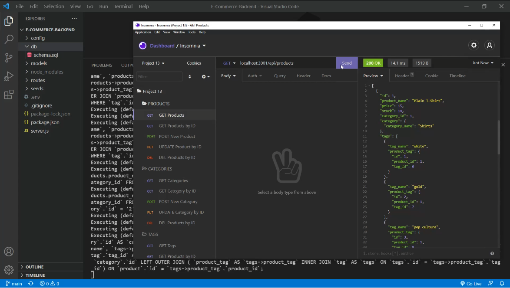

# E-Commerce-Backend

[](https://opensource.org/licenses/MIT)

## Description
E-Commerce-Backend is a project dedicated to managing a MySQL2 backend for an e-commerce website. Users can POST, PUT and DEL products, categories, and tags. They may also get products, categories, and tags by ID or get all of each.

## Table of Contents
* [Installation](#installation)
* [Usage](#usage)
* [License](#license)
* [Contributing](#contributing)
* [Questions and Contact Info](#questions-and-contact-info)



[A full video can be found here.](https://watch.screencastify.com/v/MFeSM6rRLYB3mtcOPiWm)

## Installation
This package is not published to NPM at this time. To install, please download from github and unzip.

## Usage
As this is not a published package, it must be ran by opening the project in an IDE of your choice and using ```npm run seed``` and ```npm start``` after the MySQL database has been set up.

## License
This project is licensed under 'MIT'. Please see LICENSE file for more info.

## Contributing
Contributions are not open at this time.

## Questions and Contact Info
* Github: https://github.com/mlkrauz
* Email: mlkrauz@protonmail.com